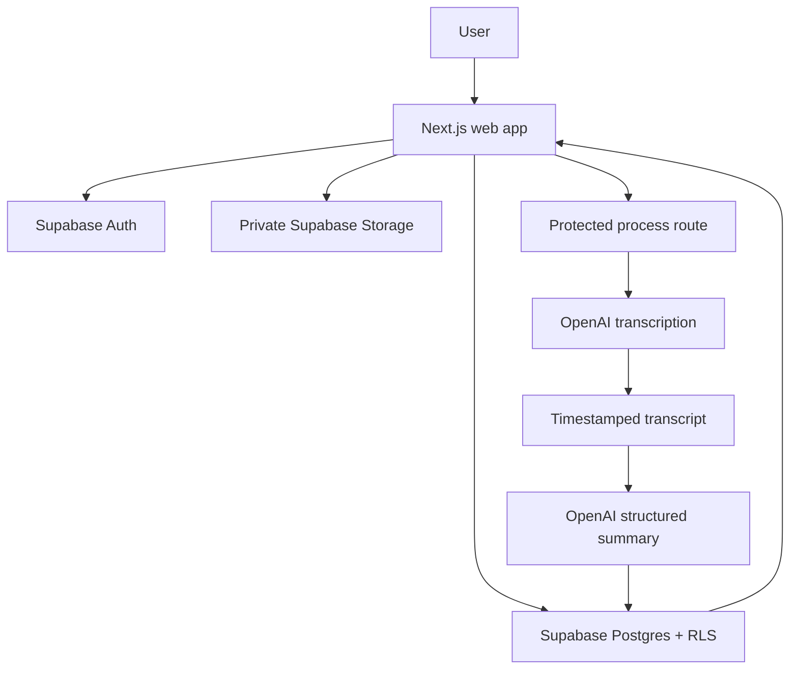

# MinuteBloom

Meetings end. Momentum starts.

MinuteBloom is a Next.js meeting summarizer that accepts meeting audio, stores it privately, transcribes it with OpenAI, generates structured notes, and presents the result in a searchable workspace with exports and grounded follow-up.

## Product snapshot

- Input: meeting audio files up to 25 MB in `mp3`, `mp4`, `mpeg`, `mpga`, `m4a`, `wav`, or `webm`
- Output: transcript, executive summary, key topics, decisions, blockers, open questions, and action items
- Privacy: private Supabase bucket, row-level security, ownership checks, and server-only service credentials
- Review path: public deterministic `/demo` workspace that does not consume paid APIs

## Screenshot

Add the captured landing and workspace screenshots here after the Playwright/browser dependency issue is resolved locally or in CI.

## Requirements mapping

- Audio input: authenticated upload flow lives under `/app/meetings/new`
- Transcript output: OpenAI transcription pipeline lives in `lib/ai/transcribe.ts`
- Summary and action items: structured summary pipeline lives in `lib/ai/summarize.ts`
- Frontend for upload and results: landing page, dashboard, upload flow, demo workspace, and meeting workspace routes are implemented
- Backend storage and processing: Supabase schema, helpers, proxy auth gate, and meeting API routes are implemented
- ASR and LLM integration: current OpenAI SDK surfaces are used for transcription and Responses API structured outputs
- GitHub-ready repo docs: this README plus `docs/`
- Demo script: `docs/DEMO_SCRIPT.md`
- Code quality: lint, typecheck, unit/integration coverage, production build, and Playwright config are included

## Architecture



## Feature set

- Original landing page with original MinuteBloom branding and copy
- Light and dark themes driven by shared OKLCH design tokens
- Public `/demo` route with deterministic fixture data
- Protected `/app` route group with dashboard, upload, meeting detail, and settings shells
- Private meeting storage and versioned Supabase migration
- Processing state machine: `uploading -> uploaded -> transcribing -> summarizing -> completed|failed`
- Structured exports in Markdown, plain text, and JSON
- Grounded Ask AI route limited to the meeting transcript and summary
- Unit, integration, and E2E test harnesses
- GitHub Actions CI workflow

## Stack

- Next.js 16.2.6 App Router
- React 19.2.4
- TypeScript 5
- Tailwind CSS 4
- OpenAI SDK 7
- Supabase SSR and JS clients
- Zod
- Motion, Sonner, tus-js-client
- Vitest, Testing Library, and Playwright

## AI pipeline

1. The browser uploads audio into the private `meeting-audio` bucket.
2. The protected process route acquires an ownership-scoped processing lock.
3. OpenAI transcription converts the file into transcript text and normalized segments.
4. The transcript is saved before summary generation so retries can reuse partial success.
5. The Responses API returns a Zod-validated structured summary.
6. Action items are persisted and the meeting is marked `completed`.

Prompt design notes live in [docs/PROMPT_DESIGN.md](/home/ridgehub/meeting_summarizer/next-app/docs/PROMPT_DESIGN.md).

## Local setup

1. Install Node 24.
2. Copy `.env.example` into `.env.local`.
3. Fill the Supabase and OpenAI variables.
4. Install dependencies with `npm install`.
5. Run `npm run dev`.

## Environment variables

```bash
NEXT_PUBLIC_APP_URL=
NEXT_PUBLIC_SUPABASE_URL=
NEXT_PUBLIC_SUPABASE_ANON_KEY=
SUPABASE_SERVICE_ROLE_KEY=
OPENAI_API_KEY=
OPENAI_TRANSCRIPTION_MODEL=
OPENAI_SUMMARY_MODEL=
```

## Supabase migration

1. Create or link a Supabase project.
2. Apply `supabase/migrations/202608230001_minutebloom_init.sql`.
3. Confirm the `meeting-audio` bucket exists and is private.
4. Add local and production auth callback URLs.

## Commands

```bash
npm run format:check
npm run lint
npm run typecheck
npm run test:coverage
npm run test:e2e
npm run build
```

## API routes

- `GET /api/health`
- `GET /api/demo-audio`
- `POST /api/meetings`
- `GET /api/meetings/[id]`
- `PATCH /api/meetings/[id]`
- `DELETE /api/meetings/[id]`
- `PATCH /api/meetings/[id]/action-items/[actionItemId]`
- `POST /api/meetings/[id]/process`
- `POST /api/meetings/[id]/chat`
- `POST /api/meetings/[id]/retry`
- `GET /api/meetings/[id]/export?format=markdown|text|json`

## Security and privacy

- Private bucket path format: `{userId}/{meetingId}/{uuid}-{sanitizedFileName}`
- RLS on `meetings` and `action_items`
- Ownership validation in server routes and queries
- Service role key stays server-only
- Errors are sanitized before persistence or response

## Limitations

- The MVP enforces a hard 25 MB upload cap.
- Live sign-in, upload, and workspace mutations are implemented, but end-to-end verification against a live Supabase and OpenAI stack is still pending environment credentials.
- Playwright browser execution is blocked in this environment by missing system libraries for Chromium, including `libnspr4.so`.
- GitHub, Supabase, and Vercel deployment steps are blocked here by missing local tooling and external account access.

## Future improvements

- Live authenticated upload flow with resumable Supabase TUS integration
- Rich action-item editing persistence from the workspace UI
- Better transcript speaker filters and audio seeking
- Real production screenshots and recorded demo artifact
- Deployment automation once GitHub, Supabase, and Vercel access are available

## Production URL

Pending deployment.

## Demo video

Recording script: `npm run test:e2e:record-demo`

Recommended output location: `test-results/`
